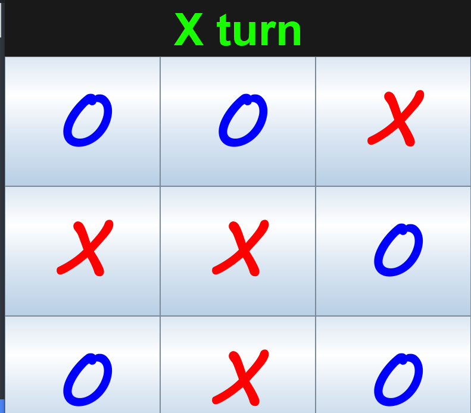

# TicTacToe Game

  

## Description

This is a simple TicTacToe game implemented in Java using Swing. The game allows two players to take turns and compete against each other until one of them wins or the game ends in a draw.

## Features

- Classic TicTacToe gameplay.
- Player vs. Player mode.
- Win and draw detection.
- Simple GUI with colorful buttons.

## How to Play

1. Clone the repository to your local machine.
2. Open the project in your Java development environment (e.g., Visual Studio Code with Java Extension Pack).
3. Compile and run the `Main.java` file to start the game.
4. The game window will open, and the players can take turns clicking on the buttons to make their moves.
5. The game will automatically detect when a player wins or if the game ends in a draw.

## Prerequisites

- Java Development Kit (JDK) installed on your machine.
- Java IDE or code editor (e.g., Visual Studio Code, IntelliJ IDEA).

## License

This project is licensed under the [MIT License](LICENSE).

## Acknowledgments

The implementation of this TicTacToe game was inspired by various online tutorials and resources. Special thanks to the authors of those tutorials for providing valuable knowledge.

## Contribution

Contributions are welcome! If you find any bugs or want to add new features, feel free to fork the repository and create a pull request.

Happy gaming! :video_game:
